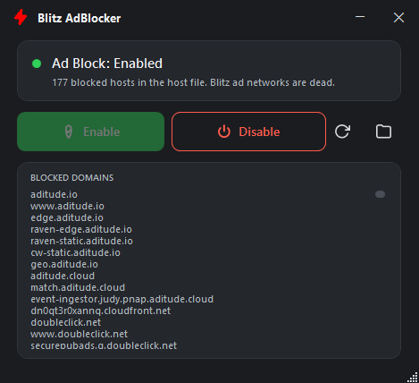

# BlitzAdBlocker

Removes ads from the [Blitz](https://blitz.gg) app.

Blitz shows ads unless you're a premium user. BlitzAdBlocker blocks the ad
networks Blitz loads from — Aditude, Google AdX, prebid bidders, video
networks and DMP syncs — so the ads never load. Blitz itself is never
modified.

Buttons:

- **Enable** — adds the ad-network domains to the hosts file
- **Disable** — removes them again

## Screenshots



The hosts file is backed up (`hosts.blitzadblock.bak`) before the block is written; the backup is never overwritten, so it always holds your pristine pre-tool hosts.
Blitz's own "Get Premium" banner is left alone — it comes from Blitz itself,
not an ad network.

## Why the hosts file

Blitz premium status is verified on Blitz's servers, so there is no local
flag that disables ads. Blitz does load its ads from distinct third-party
domains, and blocking those at the hosts level kills every ad request without
touching the app.

## Building from source

Requires the [.NET SDK](https://dotnet.microsoft.com/download) (8.0 or newer):

```sh
dotnet build src/BlitzAdBlocker/BlitzAdBlocker.csproj -c Release
```

Output: `src/BlitzAdBlocker/bin/Release/net48/BlitzAdBlocker.exe` (a single
exe, ~30 KB, for Windows 10/11 — .NET Framework 4.8 ships with Windows, nothing
to install).

Fonts: Segoe UI (system, ships with Windows).

## AdGuard Format

The same blocklist, curated from the ad networks Blitz itself loads (Aditude,
Google AdX, prebid bidders, DMP syncs), is available in AdGuard filter syntax
for anyone who doesn't want to touch the hosts file or wants to block ads on
other devices:

```
https://raw.githubusercontent.com/starkayc/BlitzAdBlocker/master/blitz-adblock.txt
```

Add it as a custom list in AdGuard DNS or any AdGuard-compatible blocker
(AdGuard Home: **Filters → DNS blocklists → Add blocklist → custom list**;
AdGuard DNS personal server: **Filters → Custom rules list**). The list ships
as `blitz-adblock.txt` in every release too.

> **Note:** Blitz bundles its own built-in DNS resolver, so it can resolve ad
> domains even when you block them at the DNS level (e.g. AdGuard DNS) — ads
> may still load in DNS-only setups. Hosts-file blocking is not bypassed this
> way, which is why this app uses the hosts file. For DNS-only setups, block
> every DNS resolver except your own so Blitz can't sneak around your DNS —
> HaGeZi's [Encrypted DNS/VPN/Tor/Proxy Bypass](https://github.com/hagezi/dns-blocklists#bypass)
> list does exactly that:
>
> ```
> https://raw.githubusercontent.com/hagezi/dns-blocklists/main/adblock/doh-vpn-proxy-bypass.txt
> ```

Releases are built by GitHub Actions and ship with a sha256 checksum.
